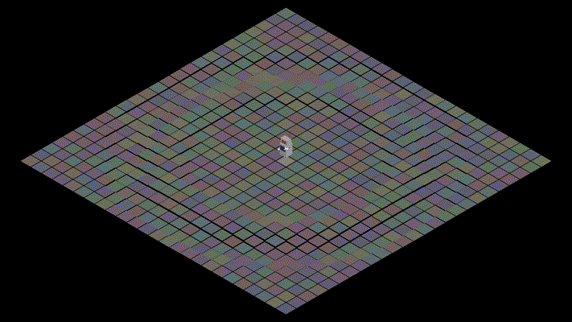

# Dancing Robot
A dancing robot for a Computer Graphics assignment.

Uses Processing (processing.org)

## Controls

H - Toggle help information

Space - Music sync

Page Up/Down - Tweak BPM

D - Toggle debug information

Press space once to set the beat start, continue pressing on rhythm to sync BPM.
Once BPM becomes stable it turns white to show it has been applied.
